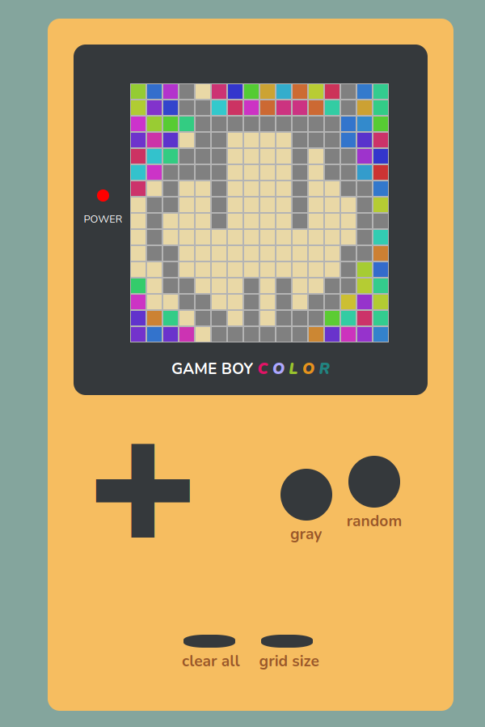

# Game-boy (etch a sketch)
> Check the [demo](https://filotaxis.github.io/Etch-a-sketch/)

This project is part of the [Odin Project](https://www.theodinproject.com).

You can draw using your mouse in the screen of the game boy.

* Pressing the `gray` button the pixels color will be gray. 

* Pressing the `random` button the pixels color will be random.

* `clear all` will erase all the drawing of the screen

* And pressing `grid size` button repeatedly will change the resolution of the screen (# of pixels). The available resolutions are [4 x 4], [8 x 8], [16 x 16]

